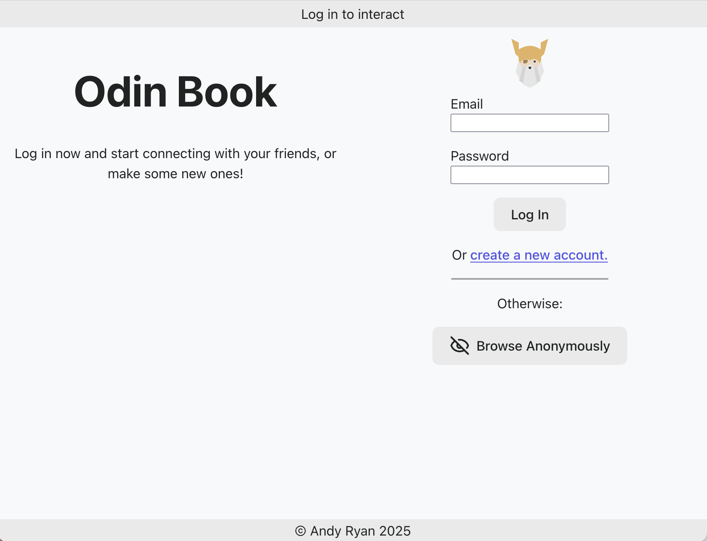

# Odin Book

## Table of Contents

- [Description](#description)
- [Installation Instructions](#installation-instructions)
- [Usage and Screenshots](#usage-and-screenshots)
- [Technologies Used](#technologies-used)
- [Dependencies and Credits](#dependencies-and-credits)
- [Project Structure](#project-structure)

## Description

This is the frontend for my social media app built for [The Odin Project](https://www.theodinproject.com) curriculum. It is built using Vite and React.

## Installation Instructions

1. Clone or fork this repo
2. cd into the project root directory (where the README.md file is located)
3. Run the following in your terminal
    - ``` bash
      npm init -y
      npm install
      ```
4. If running the API locally
   1. Find the URL
       - For a Node.js / Express app this would be in: *backend_folder/app.js* at the bottom
   2. Update the API URL
        -  ``` bash
           code src/functions/apiCommunication.js 
           ```
        - Update `const apiUrl` with the new URL. It is likely http://localhost:3000
          - Be sure to remove the trailing "/" if there is one
5. `npm run dev` then navigate to the url displayed in the terminal: `➜  Local:   http://localhost:5173/`
6. `^` + `c` will end the process

## Usage and Screenshots



There are two ways to sign in to the app:
- The simplest is to browse anonymously; this sends a request for an anonymous account to the API, which first wipes the existing anonymous account then returns a clean copy.
- You can also sign in to an existing account or create a new one.
  - For new accounts you will be directed to the profile creation page after signing up and logging in
 
After signing in you can manage your account with the button in the top right corner or interact with other users via the toolbar on the left.

- [Live Preview](https://odin-book-frontend-8xo.pages.dev/)
- [Backend Repo](https://github.com/aRav3n/odin_book_backend)

### Features
- Combined login and signup page
- Browse anonymously with a guest account
- Users can add a custom profile photo URL or use the default
- User profile can be modified while signed in

## Technologies Used

### Frontend

- <a href="https://vite.dev/"> Vite </a>
- <a href="https://react.dev/"> React</a>
- <a href="https://developer.mozilla.org/en-US/docs/Web/JavaScript"> JavaScript</a>
- <a href="https://developer.mozilla.org/en-US/docs/Web/HTML"> HTML</a>
- <a href="https://developer.mozilla.org/en-US/docs/Web/CSS"> CSS</a>

### Development Tools

- <a href="https://code.visualstudio.com/"> VS Code</a>
- <a href="https://www.npmjs.com/"> NPM</a>
- <a href="https://git-scm.com/"> Git</a>

### Hosting

- <a href="https://www.cloudflare.com/"> Cloudflare</a>
- <a href="https://github.com/"> Github</a>

## Dependencies and Credits

### Package Dependencies

- [@eslint/js](https://www.npmjs.com/package/@eslint/js)
- [@types/react](https://www.npmjs.com/package/@types/react)
- [@types/react-dom](https://www.npmjs.com/package/@types/react-dom)
- [@vitejs/plugin-react](https://www.npmjs.com/package/@vitejs/plugin-react)
- [eslint](https://www.npmjs.com/package/eslint)
- [eslint-config-prettier](https://www.npmjs.com/package/eslint-config-prettier)
- [eslint-plugin-react-hooks](https://www.npmjs.com/package/eslint-plugin-react-hooks)
- [eslint-plugin-react-refresh](https://www.npmjs.com/package/eslint-plugin-react-refresh)
- [globals](https://www.npmjs.com/package/globals)
- [lucide-react](https://www.npmjs.com/package/lucide-react)
- [react-dom](https://www.npmjs.com/package/react-dom)
- [react-router-dom](https://www.npmjs.com/package/react-router-dom)
- [uuid](https://www.npmjs.com/package/uuid)

### Other Credits

- [Devicion](https://devicon.dev/)
- [Skillicons](https://skillicons.dev/)


## Project Structure

```bash
├──public/                 # Locally stored images
├──src/
    ├── components/        # Smaller React components that are not a whole page
    ├── functions/         # Functions used by React components
    └── pages/             # Larger React components responsible for displaying a page
```
